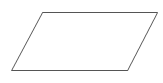
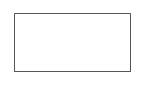
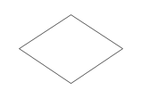
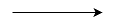
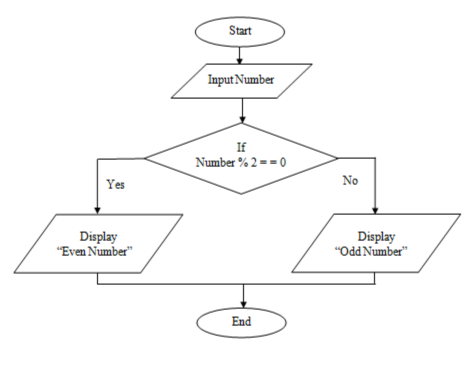

# Algoritma & Struktur Data (Python)

## Algoritma

Algoritma merupakan langkah-langkah terinci untuk menyelesaikan suatu masalah atau mencapai tujuan tertentu. Dalam bahasa pemrograman, kita bisa menggunakan atau bahkan tidak perlu menggunakan algoritma. Tapi hampir 99% pastinya perlu algoritma. Misalnya saja kita sudah tahu algoritma dasar dari perulangan dan perkondisian.

## Contoh Algoritma dalam Kehidupan Sehari-hari

Mari kita ilustrasikan penggunaan algoritma dengan aktivitas sehari-hari kita, seperti cara menggunakan komputer atau smartphone. Ketika kita menyalakan komputer, prosesnya melibatkan langkah-langkah tertentu seperti booting, memasukkan password, dan menggunakan aplikasi. Begitu pula ketika menggunakan smartphone, langkah-langkah untuk membuka aplikasi merupakan suatu contoh dari penggunaan algoritma dalam kehidupan sehari-hari.

## Mengenal Pseudocode

Pseudocode adalah cara untuk menulis langkah-langkah suatu algoritma secara informal, menggunakan bahasa manusia agar mudah dipahami sebelum diimplementasikan dalam bahasa pemrograman tertentu. Ini membantu pengembang dalam merencanakan dan merancang algoritma sebelum menuju ke tahap penulisan kode.

Contoh Algoritma Sederhana

Misalnya, mari kita lihat contoh algoritma sederhana untuk menemukan bilangan terbesar dari dua bilangan:

Algoritma untuk menemukan Bilangan Terbesar

1. Mulai

2. Masukkan dua bilangan, bilangan1 dan bilangan2

3. Jika bilangan1 lebih besar dari bilangan2, maka:

4. Tampilkan bilangan1 sebagai bilangan terbesar

5. Jika tidak, Tampilkan bilangan2 sebagai bilangan terbesar
6. Selesai

Notes: dalam pseudocode tidak terpaku pada penggunaaan kata tertentu.

Latihan:

1. Buatlah algoritma untuk menghitung luas persegi panjang.
2. Tuliskan algoritma untuk mencari nilai rata-rata dari tiga angka.
3. Buat pseudocode untuk menemukan bilangan prima.

## Mengenal Flowchart

Flowchart atau diagram alir ada lah representasi grafis dari alur logika dalam sebuah program atau proses. Ini membantu dalam menggambarkan urutan langkah-langkah secara visual untuk memecahkan masalah atau menjalankan suatu tugas.

Bagi developer yang akan mengembangkan sistem yang kompleks, membuat flowchart dapat menjadi langkah awal yang dianjurkan sebelum mulai melakukan pengkodean. Mengapa demikian?

Karena dalam rangka untuk mengembangkan sistem yang kompleks, memiliki gambaran yang jelas mengenai proses atau prosedur dari awal hingga akhir dari sistem yang dibangun sangatlah penting. Tanpa adanya flowchart, terkadang ketika sedang mengerjakan proyek, kita dapat kehilangan alur dari sistem yang sedang dibuat. Tentu saja, hal ini bisa berdampak pada kode yang dibuat.

Simbol-simbol dalam Flowchart

Simbol Awal dan Akhir:


Simbol persegi panjang dengan lengkungan menggambarkan langkah awal dan akhir dari algoritma.

Input / Output:



Simbol ini, berbentuk jajar genjang, mewakili proses input / output seperti memberikan nilai pada suatu variabel atau menampilkan value pada suatu variable

Proses:



Simbol ini, berbentuk persegi panjang, mewakili operasi atau tindakan yang dilakukan, seperti perhitungan matematika atau manipulasi data.

Keputusan / Conditional:



Berbentuk diamond dan menunjukkan percabangan logika, seperti kondisi "jika-atau".

Aliran:



Panah menggambarkan aliran dari satu langkah ke langkah berikutnya, menunjukkan urutan eksekusi dalam algoritma.

Contoh Flowchart

Berikut adalah contoh flowchart untuk menentukan apakah suatu bilangan adalah bilangan genap atau ganjil:



Kegunaan Flowchart

- Mempermudah pemahaman algoritma: Diagram alir membantu dalam visualisasi alur logika sehingga mudah dipahami oleh programmer.
- Komunikasi yang efektif: Memungkinkan berbagai pihak untuk memahami proses atau algoritma tanpa memerlukan pengetahuan pemrograman yang mendalam.
- Membantu dalam pemecahan masalah: Dengan melihat secara visual, kita dapat dengan mudah mengidentifikasi kesalahan atau perbaikan yang diperlukan dalam algoritma.

Latihan:

1. Rancang flowchart untuk menghitung gaji seorang karyawan berdasarkan jumlah jam kerja dan upah per jam.
2. Buat flowchart untuk kalkulator sederhana yang dapat menambah, mengurangi, mengalikan, atau membagi dua angka berdasarkan pilihan pengguna.
3. Buat flowchart yang menentukan grade (kelas) dari nilai mahasiswa berdasarkan rentang nilai tertentu, seperti A, B, C, D, atau E.

## Kesimpulan

Algoritma merupakan landasan utama dalam pemrograman. Hal ini membantu dalam memecahkan masalah dan merancang solusi secara sistematis. Pseudocode, sementara itu, memungkinkan kita untuk merencanakan algoritma sebelum menuliskannya dalam bahasa pemrograman yang spesifik.

Flowchart merupakan alat visual yang kuat dalam merencanakan dan memahami alur logika algoritma. Dalam pembelajaran tentang algoritma, pemahaman tentang simbol-simbol flowchart dan kemampuan untuk menggambarkan langkah-langkah algoritma secara visual sangat penting. Dengan menggunakan flowchart, pengembang dapat dengan mudah merancang, menganalisis, dan memperbaiki algoritma mereka sebelum menuliskannya dalam bahasa pemrograman.

Dengan memahami konsep algoritma, pseudocode dan flowchart, kita dapat mengembangkan keterampilan pemecahan masalah yang lebih baik dalam dunia pemrograman.

## Struktur Data (Python)

## Kondisional dan Tipe Data

### Kondisional dalam Python

Kondisional memungkinkan program untuk membuat keputusan berdasarkan kondisi tertentu. Kondisional yang umum digunakan di Python meliputi `if`, `elif`, dan `else`.

#### Statement `if-else`

Statement `if-else` mengizinkan program untuk menentukan dua hasil yang mungkin.

Contoh:

```python
# Menentukan apakah seseorang memenuhi syarat untuk memilih berdasarkan usia
usia = int(input("Masukkan usia Anda: "))

if usia >= 18:
    print("Anda memenuhi syarat untuk memilih.")
else:
    print("Maaf, Anda belum memenuhi syarat untuk memilih.")
```

#### Statement `if-elif-else`

Statement `if-elif-else` digunakan untuk mengevaluasi kondisi tertentu dan melakukan tindakan berdasarkan hasilnya.

Contoh:

```python
# Mengecek apakah suatu angka positif, negatif, atau nol
angka = float(input("Masukkan angka: "))

if angka > 0:
    print("Angka adalah positif")
elif angka == 0:
    print("Angka adalah nol")
else:
    print("Angka adalah negatif")
```

### Tipe Data dalam Python

Tipe data menentukan jenis data yang dapat disimpan oleh variabel. Tipe data yang umum digunakan di Python meliputi int, float, str dan bool.

#### 1. Tipe Data Numerik

Tipe data numerik seperti bilangan bulat (`int`) dan pecahan (`float`) memungkinkan operasi aritmatika.

Contoh:

```python
# Operasi aritmatika dengan tipe data numerik
bilangan1 = 10 # int
bilangan2 = 5.7 # float

print(type(bilangan1))
print(type(bilangan2))

jumlah = bilangan1 + bilangan2
kurang = bilangan1 - bilangan2
kali = bilangan1 * bilangan2
bagi = bilangan1 / bilangan2

print("Penjumlahan:", jumlah)
print("Pengurangan:", kurang)
print("Perkalian:", kali)
print("Pembagian:", bagi)

```

#### 2. Tipe Data String

Tipe data string (`str`) memungkinkan penyimpanan data teks dan memiliki berbagai metode untuk manipulasi.

Contoh:

```python
# Manipulasi string menggunakan method string
kalimat = "Ini adalah contoh kalimat."

print(type(kalimat))

# Mengonversi ke huruf besar
print(kalimat.upper())

# Memisahkan kata-kata
kata = kalimat.split()
print("Kata pertama:", kata[0])

```

#### 3. Tipe Data Boolean

Tipe data boolean (`bool`) dapat memiliki nilai `True` atau `False` dan sering digunakan dalam kondisional.

Contoh:

```python
# Menggunakan nilai boolean dalam pernyataan kondisional
benar = True

if benar:
    print("Ini akan dicetak karena nilai benar.")
else:
    print("Ini tidak akan dicetak karena nilai salah.")

```

### Tipe Data dalam Python - Lanjutan

#### 1. Tipe Data List (Daftar)

Tipe data list (daftar) memungkinkan penyimpanan koleksi item dalam urutan yang dapat diubah.

```python
# Contoh penggunaan tipe data list (daftar)
buah = ['apel', 'pisang', 'jeruk', 'anggur']

# Menampilkan semua buah dalam list
print("Daftar Buah:", buah)

# Menampilkan buah pertama dalam list
print("Buah pertama:", buah[0])

# Menambahkan buah ke list
buah.append('nanas')
print("Daftar Buah setelah ditambahkan:", buah)

```

#### 2. Tipe Data Tuple

Tipe data tuple (tuple) adalah koleksi item dalam urutan yang tidak dapat diubah.

```python
# Contoh penggunaan tipe data tuple
hari = ('Senin', 'Selasa', 'Rabu', 'Kamis', 'Jumat')

# Menampilkan semua hari dalam tuple
print("Hari dalam seminggu:", hari)

# Menampilkan hari pertama dalam tuple
print("Hari pertama:", hari[0])
```

#### 3. Tipe Data Dictionary (Kamus)

Tipe data dict (kamus) memungkinkan penyimpanan data dalam bentuk pasangan kunci-nilai.

```python
# Contoh penggunaan tipe data dictionary (kamus)
siswa = {'nama': 'Ani', 'usia': 15, 'kelas': 'XII-A'}

# Menampilkan data siswa
print("Data Siswa:", siswa)

# Menampilkan nilai dari kunci tertentu dalam kamus
print("Usia Siswa:", siswa['usia'])

# Menambahkan data baru ke kamus
siswa['nilai'] = 85
print("Data Siswa setelah ditambahkan nilai:", siswa)

```

## Latihan

1. [https://www.codecademy.com/courses/learn-python-3](https://www.codecademy.com/courses/learn-python-3)
2. [Grade Mahasiswa](question_grade_students.md)
3. [Graduates](question_graduates.md)
4. [Pengunjung Bar](question_bar.md)
5. [Bermain dengan string](question_string.md)

## Perulangan / Iterasi

Perulangan adalah konsep penting dalam pemrograman yang memungkinkan kita untuk mengeksekusi sekelompok pernyataan berulang kali. Dalam Python, terdapat beberapa jenis perulangan, yang paling umum adalah `for` dan `while`.

### `for` Loop

`for` loop digunakan untuk melakukan iterasi (pengulangan) melalui urutan (seperti list, tuple, string, dll.) atau objek yang dapat diiterasi.

Contoh 1:

```python
# Menggunakan for loop untuk mencetak elemen dalam list
buah = ["apel", "jeruk", "pisang"]
for buah_satuan in buah:
    print(buah_satuan)
```

Di dalam contoh di atas, `for` loop digunakan untuk mengiterasi melalui setiap elemen dalam list `buah` dan mencetak setiap elemen.

Contoh 2:

```python
# Menggunakan for loop untuk mencetak angka dari sebuah range
for i in range(5):
    print(i, end=' ')  # Output: 0 1 2 3 4


# Menggunakan for loop untuk mencetak angka dari sebuah range dengan batas awal dan akhir
for i in range(2, 8):
    print(i, end=' ')  # Output: 2 3 4 5 6 7


# Menggunakan for loop untuk mencetak angka dari sebuah range dengan batas awal dan akhir dan step
for i in range(1, 10, 2):
    print(i, end=' ')  # Output: 1 3 5 7 9
```

### `while` Loop

`while` loop akan terus mengeksekusi blok kode selama kondisi yang ditentukan benar (True).

Contoh:

```python
# Menggunakan while loop untuk mencetak angka dari 1 hingga 5
angka = 1
while angka <= 5:
    print(angka)
    angka += 1

```

Pada contoh di atas, `while` loop akan terus berjalan selama `angka` kurang dari atau sama dengan 5. Setiap iterasi, nilai `angka` akan dicetak, dan nilai `angka` akan bertambah satu.

## Function

Fungsi dalam Python adalah blok kode yang dapat dipanggil untuk melakukan tugas tertentu. Fungsi memungkinkan kita untuk memecah kode menjadi bagian-bagian yang lebih kecil, mempermudah pengelolaan, dan mengurangi duplikasi kode. Struktur function seperti contoh berikut:

```python
def nama_function(parameter1, parameter2, ...):
    # Your actions or operations go here
    
    return [expression]
```

Contoh:

```python
def sapa(nama):
    print("Halo, " + nama + "! Selamat datang di program ini.")
```

Di dalam contoh di atas, kita telah membuat fungsi `sapa` yang menerima satu parameter `nama` dan mencetak pesan sambutan dengan nama yang diberikan.

Memanggil Fungsi:

Fungsi dipanggil dengan menuliskan namanya diikuti dengan tanda kurung dan argumen jika fungsi memerlukan parameter.

Contoh Memanggil Fungsi:

```python
sapa("Andi")
```

Dengan memanggil `sapa("Andi")`, fungsi `sapa` akan dijalankan dengan nilai `"Andi"` sebagai argumen. Pesan sambutan akan dicetak sesuai dengan nama yang diberikan.

Fungsi dengan Return Value:

Fungsi juga dapat mengembalikan nilai menggunakan pernyataan `return`.

Contoh Fungsi dengan Return Value:

```python
def tambah(a, b):
    hasil = a + b
    return hasil
```

Fungsi `tambah` di atas menerima dua parameter `a` dan `b`, menjumlahkannya, dan mengembalikan hasil penjumlahan.

Dengan menggunakan fungsi, Anda dapat membuat blok kode yang terorganisir, dapat dipanggil kembali, dan mengurangi repetisi.

### Latihan Soal

- [Bermain dengan Perulangan & Function](question_loops.md)
- [Inventory Management System](question_inventory.md)

## Perulangan Bersarang (Nested Loops)

Perulangan bersarang adalah konsep di mana satu perulangan ditempatkan di dalam perulangan lain. Ini memungkinkan kita untuk melakukan pengulangan dalam pengulangan.

Contoh:

```python

for outer_variable in outer_range:
    # Outer loop statements

    for inner_variable in inner_range:
        # Inner loop statements

    # Statements outside the inner loop but inside the outer loop

# Outer loop for rows
for i in range(1, 6):
    # Inner loop for columns
    for j in range(1, 3):
        # Print the product of i and j, end with a tab
        print(f"B: {i}, K {j}", end="\n")

    # Move to the next line after each row is printed
    print()
```

Kode di atas menggunakan perulangan bersarang. Loop pertama mengatur iterasi melalui setiap baris, sementara loop kedua mengatur iterasi melalui setiap elemen di setiap baris.

## Manipulasi File / Berkas

Manipulasi berkas adalah proses membaca, menulis, atau memanipulasi informasi dalam berkas menggunakan Python. Python menyediakan sejumlah fungsi bawaan yang memungkinkan kita untuk melakukan operasi-operasi pada berkas, seperti membaca isi berkas, menulis ke berkas, dan lainnya.

Membuka Berkas:

Untuk membuka berkas dalam Python, kita menggunakan fungsi `open()`. Fungsi ini memerlukan setidaknya dua argumen: nama berkas dan mode.

Contoh Membuka Berkas:

```python
# Membuka berkas teks untuk dibaca
nama_berkas = "contoh.txt"
file = open(nama_berkas, "r")
```

Di dalam contoh di atas, `open("contoh.txt", "r")` membuka berkas bernama "contoh.txt" dalam mode "r" (mode baca).

Membaca Isi Berkas

Setelah membuka berkas, kita dapat membaca isi berkas menggunakan metode `read()`.

Contoh Membaca Isi Berkas:

```python
# Membaca isi berkas dan mencetaknya
isi_berkas = file.read()
print(isi_berkas)
```

Dengan menggunakan `file.read()`, kita membaca seluruh isi berkas yang telah dibuka sebelumnya dan kemudian mencetak isinya.

Menulis ke Berkas:

Untuk menulis ke berkas, kita membuka berkas dalam mode penulisan ("w" untuk menulis, "a" untuk menambahkan ke berkas yang sudah ada).

Contoh Menulis ke Berkas:

```python
# Membuka berkas untuk menulis dan menulis teks ke dalamnya
nama_berkas = "output.txt"
file_tulis = open(nama_berkas, "w")
file_tulis.write("Halo, ini adalah contoh teks yang ditulis ke dalam berkas.")
file_tulis.close()  # Penting untuk menutup berkas setelah selesai menulis

```

Dalam contoh di atas, `open("output.txt", "w")` membuka berkas dengan nama "output.txt" dalam mode menulis. Kemudian, `file_tulis.write()` digunakan untuk menulis teks ke dalam berkas.

Sangat penting untuk menutup berkas setelah selesai bekerja dengan berkas untuk memastikan sumber daya yang digunakan oleh berkas dibebaskan.

Cara lain supaya tidak perlu melakukan close secara manual bisa menggunakan syntax `with`. 

Syntax `with` digunakan dalam konteks "Context Manager" untuk mengelola sumber daya seperti membuka file atau koneksi database. Ini memastikan bahwa sumber daya yang diakses dengan with akan dikelola dengan benar, dan jika terjadi kesalahan, sumber daya tersebut akan ditutup secara otomatis.

Contoh:

```python
# Membaca isi berkas menggunakan 'with'
nama_berkas = "contoh.txt"

# Membuka dan membaca berkas dengan 'with'
with open(nama_berkas, 'r') as file:
    isi_berkas = file.read()
    print(isi_berkas)
# Setelah keluar dari blok 'with', berkas akan ditutup secara otomatis
```

Pada contoh diatas,

- `with open(nama\_berkas, 'r') as file: membuka berkas "contoh.txt" dalam mode baca.
- Di dalam blok with, isi berkas dibaca dengan file.read() dan dicetak.
- Setelah keluar dari blok with, berkas akan ditutup secara otomatis. Tidak perlu lagi memanggil file.close().

Membaca Berkas Menjadi Per Baris

Isi contoh.txt:

```txt
Baris 1
Baris 2
Baris 3
```

```python
with open("contoh.txt", "r") as file:
    lines = file.readlines() # Membaca file line per line

    for line in lines:
        print(line.strip())
    
    print("-----")

    print(lines[1])

    print("-----")
    
    lines.pop(1)

    for line in lines:
        print(line.strip())
        
    print("-----")
        
    lines.append("Baris Baru")
    for line in lines:
        print(line.strip())    

```

Mode Read / Write File di Python:

1. **Mode Baca (`"r"`):**
   - Mode `"r"` digunakan untuk membaca isi dari sebuah file.
   - Ini merupakan mode default jika tidak menyebutkan mode secara eksplisit.
   - Jika file tidak ditemukan, akan menimbulkan `FileNotFoundError`.
   - Contoh: `with open("contoh.txt", "r") as file:`

2. **Mode Tulis (`"w"`):**
   - Mode `"w"` digunakan untuk menulis ke sebuah file.
   - Jika file sudah ada, akan menghapus isi file dan membuat file kosong.
   - Jika file tidak ada, akan membuat file baru.
   - Contoh: `with open("output.txt", "w") as file:`

3. **Mode Tambah (`"a"`):**
   - Mode `"a"` digunakan untuk menambahkan data ke akhir file.
   - Jika file sudah ada, akan menulis pada bagian akhir file.
   - Jika file tidak ada, akan membuat file baru.
   - Contoh: `with open("log.txt", "a") as file:`

### Latihan Soal 2

- [Nested Loops](question_nested_asteriks.md)
- [Nested Loops Challenge (Optional)](question_nested_optional.md)
- [Notes App](question_note_app.md)

## TODO: Setup Python Development Environment
